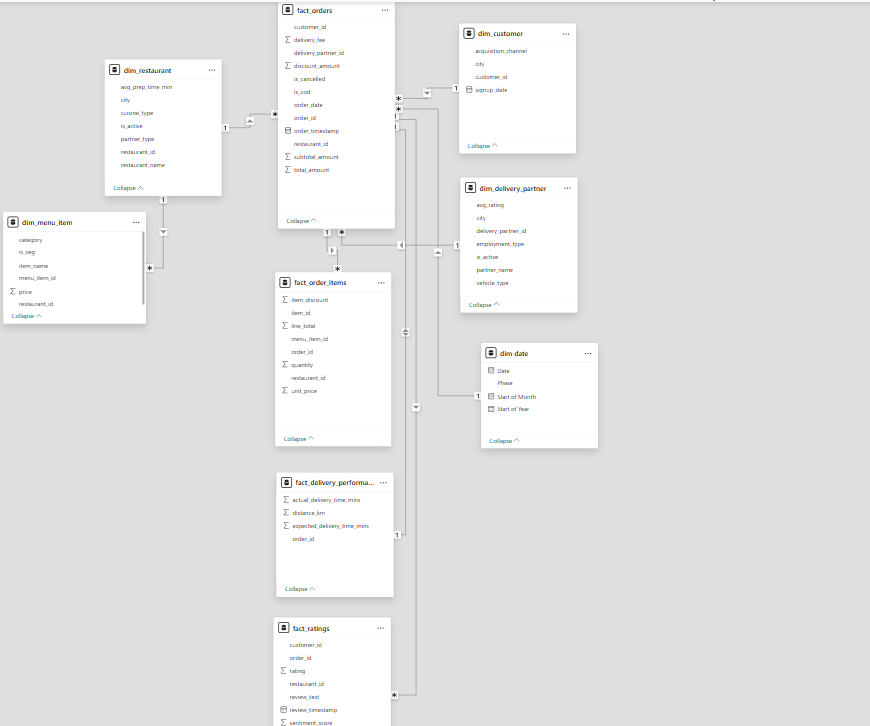
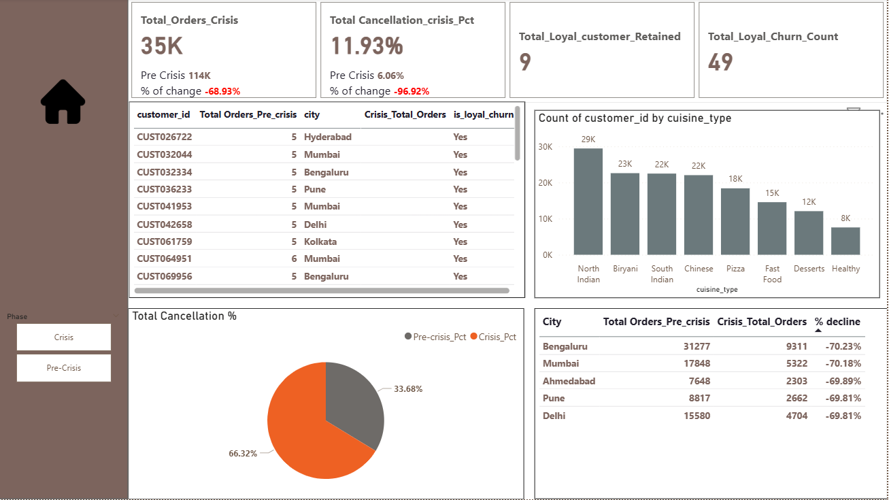
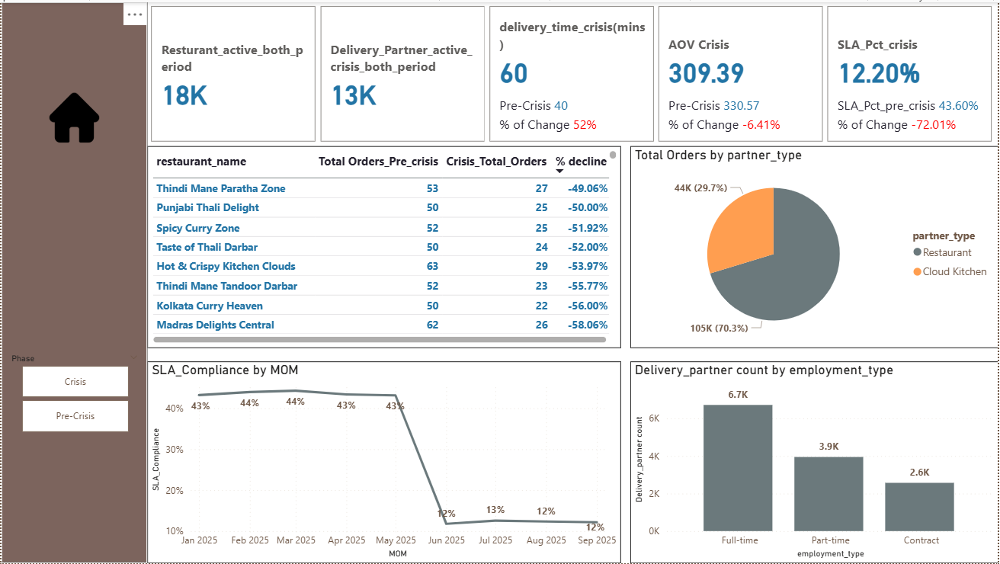

# QuickBite Crisis Recovery Analysis | Power BI Project

# Problem Statement

QuickBite Express, a Bengaluru-based food delivery startup, faced a major crisis in June 2025 due to food safety violations and delivery outages during the monsoon season.  
The crisis resulted in declining customer trust, reduced orders, poor delivery performance, negative customer sentiment, and revenue loss.

The goal of this project is to analyze:
- Customer behavior before and during the crisis
- Revenue and order decline
- Delivery performance and SLA impact
- Customer ratings and sentiment trends
- Loyal customer churn
- City-level business impact

---

# Data Model

### Data Modeling Approach

  are connected to the central fact table for filtering and analysis.

- A snowflake schema relationship is also used where `dim_menu_item` is connected through `dim_restaurant`.

This model helped in performing efficient analysis across customer behavior, delivery performance, restaurant trends, and sentiment analysis.

---

# Dashboard Preview

## Customer Analysis

## Delivery & Restaurant Analysis

---
🔗 **Live Dashboard:**
🔗 [View Live Dashboard](https://app.powerbi.com/view?r=eyJrIjoiMGJiYTAyMmItYjZkYi00MzkwLTk1YjUtNTQ3MjhjMGJjN2I2IiwidCI6ImM2ZTU0OWIzLTVmNDUtNDAzMi1hYWU5LWQ0MjQ0ZGM1YjJjNCJ9&pageName=0fec0c3dcc128f291a3f)
# Key Insights

- Total orders dropped from **149K** in the pre-crisis period to **35K** during the crisis, showing a massive **68% decline in customer demand**.

- Revenue declined from **37M** before the crisis to **10M** during the crisis, indicating a **70% business impact after the operational and food safety issues**.

- Average Order Value decreased from **330 to 309**, showing that customers spent less per order during the crisis period.

- Average delivery time increased from **40 minutes to 60 minutes**, which represents a **52% increase in delivery delays**.

- SLA performance dropped sharply from **43% to 12%**, highlighting major operational inefficiencies during the crisis.

- Customer ratings fell from **4.5 to 2.5**, reflecting a **44.53% decline in customer satisfaction**.

- Sentiment score decreased from **0.75 in the pre-crisis period to -0.25 during the crisis**, showing a strong shift from positive to negative customer sentiment.

- Out of **69K total reviews**, around **12K reviews were negative**, with most complaints related to:
  - Food quality issues
  - Food safety concerns
  - Packaging problems

- Loyal customer retention was heavily impacted, as **49 loyal customers churned**, while only **9 loyal customers remained active during the crisis**.

- Bengaluru experienced the highest order decline at **70.23%**, followed closely by Mumbai (**70.18%**) and Ahmedabad (**69.89%**).

- Bengaluru also received the highest number of ratings below 2 stars, indicating severe customer dissatisfaction in the city during the crisis.

- North Indian cuisine remained the most preferred cuisine in both the pre-crisis and crisis periods, showing that cuisine preference remained stable despite operational challenges.

- Around **18K restaurants stayed active across both periods**, which suggests that the major issue was customer trust and operational performance rather than restaurant availability.

- Cancellation contribution during the crisis period increased significantly, accounting for **66% of total cancellations**.

---

# Business Conclusion

The analysis shows that the crisis had a severe impact on customer trust, delivery performance, and overall business growth.  
Operational delays, food safety concerns, and poor service quality resulted in lower customer satisfaction, reduced orders, and significant revenue loss.

---

# Recommendations

- Improve food safety monitoring and restaurant quality checks.
- Reduce delivery delays by strengthening operational infrastructure.
- Focus on rebuilding customer trust through recovery campaigns and loyalty offers.
- Monitor customer reviews and sentiment regularly to identify issues early.
- Improve packaging quality and SLA tracking to enhance customer experience.

---

# Tools Used

- Power BI
- Power Query
- DAX
- Data Modeling
# Dataset Credit

Dataset and problem statement provided by **Codebasics Resume Project Challenge**.  

🔗 https://codebasics.io/

